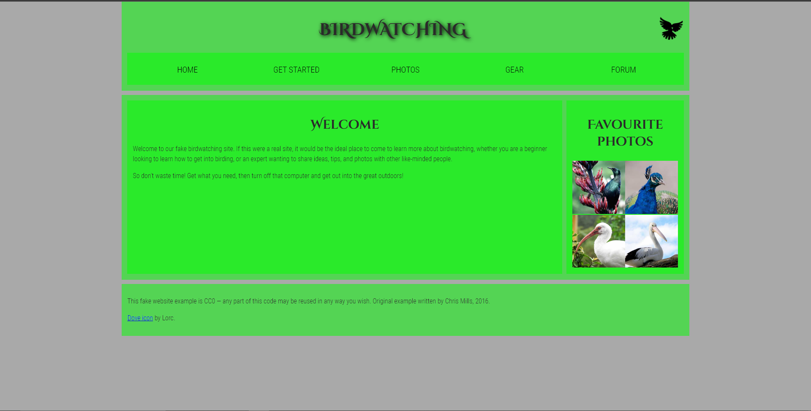

# Examen 2 HTML Ruben Lechosa Cervantes

## Descripción

En este examen lo que tenemos que haces es descargar la base que nos ha pasado el profesor y completar linkeando el css para que se vea como en la imagen:

## Pre-requisitos

Para hacer esta practica necesitamos:

1. Visual Studio Code
2. El .zip con la base del examen
3. Una cuenta en GitHub

## Realización

1. Descargar la base del examen [Base examen](https://github.com/mdn/learning-area/blob/master/html/introduction-to-html/structuring-a-page-of-content-start/assets.zip?raw=true)
2. Modificar el html con el color y enlazar el .css con el html y todas las fotos
3. Crear un repositorio nuevo en GitHub y subir el examen
4. Hacer un READme.md con la explicacion del proyecto

## Como ver si funciona

Para comprobar si funciona debemos copiar el link del repositorio y comprobar por ejemplo en modo incognito si lo podemos abrir y esta todo lo que pide el profesor, también podemos pasar el link a un amigo para hacer la comprobación.

## Wiki

https://faadia.github.io/Birdwatching/

## Autor

Ruben Lechosa Cervantes

## Licencia

No he usado ninguna licencia.

